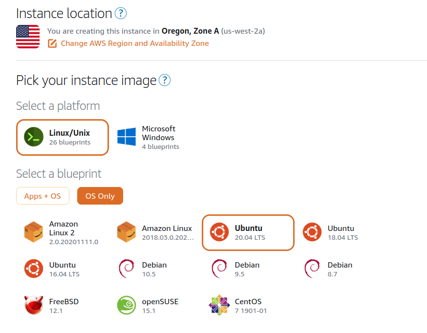
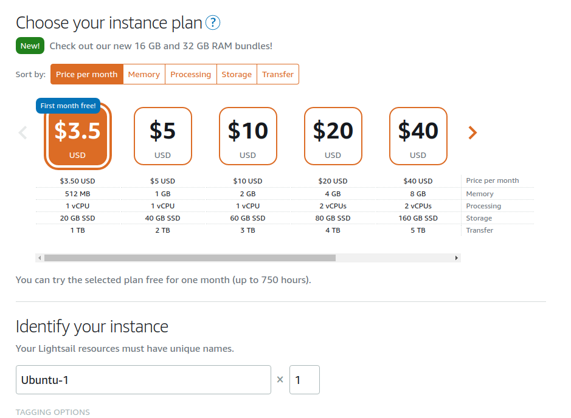
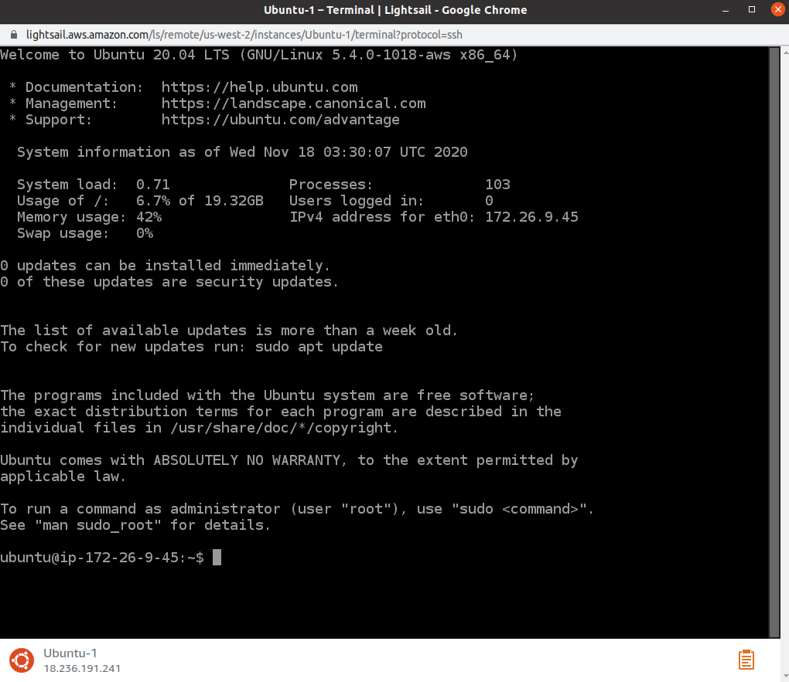
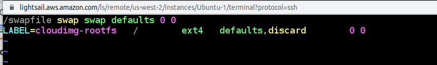
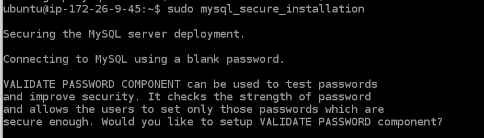
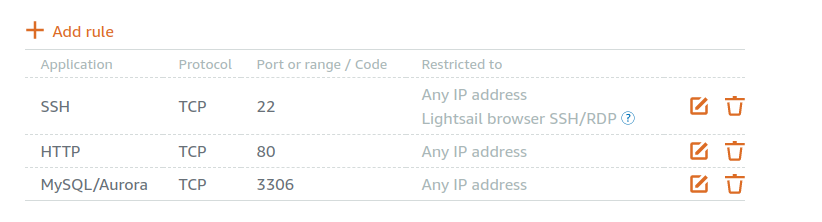

# Create MySQL Database in Lightsail






ssh into the instance




# Install MySQL

https://www.digitalocean.com/community/tutorials/how-to-install-mysql-on-ubuntu-18-04

```
sudo apt update
sudo apt install mysql-server
sudo mysql_secure_installation
```


# Error caused by swap space

It may encounter error like such:

```
● mysql.service - MySQL Community Server
     Loaded: loaded (/lib/systemd/system/mysql.service; enabled; vendor preset: enabled)
     Active: activating (auto-restart) (Result: signal) since Wed 2020-11-18 03:33:26 UTC;
 68ms ago
    Process: 2860 ExecStartPre=/usr/share/mysql/mysql-systemd-start pre (code=exited, stat
us=0/SUCCESS)
    Process: 2878 ExecStart=/usr/sbin/mysqld (code=killed, signal=KILL)
   Main PID: 2878 (code=killed, signal=KILL)
     Status: "Server startup in progress"

Nov 18 03:33:26 ip-172-26-9-45 systemd[1]: mysql.service: Failed with result 'signal'.
Nov 18 03:33:26 ip-172-26-9-45 systemd[1]: Failed to start MySQL Community Server.
dpkg: error processing package mysql-server-8.0 (--configure):
 installed mysql-server-8.0 package post-installation script subprocess returned error exi
t status 1
Setting up libcgi-pm-perl (4.46-1) ...
Setting up libhtml-template-perl (2.97-1) ...
dpkg: dependency problems prevent configuration of mysql-server:
 mysql-server depends on mysql-server-8.0; however:
  Package mysql-server-8.0 is not configured yet.

dpkg: error processing package mysql-server (--configure):
 dependency problems - leaving unconfigured
Setting up libcgi-fast-perl (1:2.15-1) ...
Processing triggers for systemd (245.4-4ubuntu3.1) ...
No apport report written because the error message indicates its a followup error from a p
revious failure.
Processing triggers for man-db (2.9.1-1) ...
Processing triggers for libc-bin (2.31-0ubuntu9) ...
Errors were encountered while processing:
 mysql-server-8.0
 mysql-server
E: Sub-process /usr/bin/dpkg returned an error code (1)
```

## Solution to the error

In order to fix this issue: [(stackoverflow)](https://stackoverflow.com/questions/35030824/mysql-on-amazon-linux-mysql-daemon-failed-to-start)

> [rtato](https://stackoverflow.com/users/2004885/rtato)
>
> I also faced the same issue when setting up an instance on Lightsail with the lowest cost instance (512MB, 1 vCPU, 20 GB SSD).
>
> I was able to solve the issue by adding a swap file in the instance.
>
> Here is the step to create a swap:
>
> 1. Use the dd command to create a swap file on the root file system, where "bs" is the block size and "count" is the number of blocks. In this example the swap file is 1 GB:
>
> ```sh
> sudo dd if=/dev/zero of=/swapfile bs=1M count=1000
> ```
>
> 1. Update the read and write permissions for the swap file:
>
> ```sh
> sudo chmod 600 /swapfile
> ```
>
> 1. Set up a Linux swap area:
>
> ```sh
> sudo mkswap /swapfile
> ```
>
> 1. Make the swap file available for immediate use by adding the swap file to swap space:
>
> ```sh
> sudo swapon /swapfile
> ```
>
> 1. Verify that the procedure was successful:
>
> ```sh
> sudo swapon -s
> ```
>
> 1. Enable the swap file at boot time by editing the `/etc/fstab` file:
>
> ```sh
> sudo vi /etc/fstab
> /swapfile swap swap defaults 0 0
> ```



## After saving, install for MySQL

then try again with this & it should work now:

```
sudo mysql_secure_installation
```




**root password**

```
root_password
```

log:

```
"/etc/fstab" 2L, 84C written
ubuntu@ip-172-26-9-45:~$ sudo apt update
Hit:1 http://us-west-2.ec2.archive.ubuntu.com/ubuntu focal InRelease
Hit:2 http://us-west-2.ec2.archive.ubuntu.com/ubuntu focal-updates InRelease
Hit:3 http://us-west-2.ec2.archive.ubuntu.com/ubuntu focal-backports InRelease
Hit:4 http://security.ubuntu.com/ubuntu focal-security InRelease
Reading package lists... Done
Building dependency tree       
Reading state information... Done
136 packages can be upgraded. Run 'apt list --upgradable' to see them.
ubuntu@ip-172-26-9-45:~$ sudo apt install mysql-server
Reading package lists... Done
Building dependency tree       
a user account created for them. This is intended only for
testing, and to make the installation go a bit smoother.
You should remove them before moving into a production
environment.

Remove anonymous users? (Press y|Y for Yes, any other key for No) : y
Success.


Normally, root should only be allowed to connect from
'localhost'. This ensures that someone cannot guess at
the root password from the network.

Disallow root login remotely? (Press y|Y for Yes, any other key for No) : y
Success.

By default, MySQL comes with a database named 'test' that
anyone can access. This is also intended only for testing,
and should be removed before moving into a production
environment.


Remove test database and access to it? (Press y|Y for Yes, any other key for No) : y
 - Dropping test database...
Success.

 - Removing privileges on test database...
Success.

Reloading the privilege tables will ensure that all changes
made so far will take effect immediately.

Reload privilege tables now? (Press y|Y for Yes, any other key for No) : y
Success.

All done! 
```

# Create Admin Users


```sql
mysql> CREATE USER 'monty'@'localhost' IDENTIFIED BY 'some_pass';
mysql> GRANT ALL PRIVILEGES ON *.* TO 'monty'@'localhost'
    ->     WITH GRANT OPTION;
mysql> CREATE USER 'monty'@'%' IDENTIFIED BY 'some_pass';
mysql> GRANT ALL PRIVILEGES ON *.* TO 'monty'@'%'
    ->     WITH GRANT OPTION;
```


run 

```
sudo mysql
```

then:

```sql
CREATE USER 'monty'@'localhost' IDENTIFIED BY 'some_pass';
```

```sql
GRANT ALL PRIVILEGES ON *.* TO 'monty'@'localhost' WITH GRANT OPTION;
```

```sql
CREATE USER 'monty'@'%' IDENTIFIED BY 'some_pass';
```

```sql
GRANT ALL PRIVILEGES ON *.* TO 'monty'@'%' WITH GRANT OPTION;
```


# Firewall

need to add mysql/aurora tcp 3306 to the firewall rules



# Extra problems bind address
```
sudo vi /etc/mysql/mysql.conf.d/mysqld.cnf
```

https://stackoverflow.com/questions/1673530/error-2003-hy000-cant-connect-to-mysql-server-on-127-0-0-1-111

If you are using `ubuntu`, you have to use the following steps to avoid this error(if there is no replication enabled):

1. run the command `vim /etc/mysql/my.cnf`
2. comment `bind-address = 127.0.0.1` using the # symbol
3. restart your mysql server once.

**Update**

In Step 1, if you cannot find `bind-address` in the `my.cnf` file, look for it in `/etc/mysql/mysql.conf.d/mysqld.cnf` file.

**Update in case of MySQL replication enabled**

Try to connect MySQL server on `IP` for which MySQL server is bind in 'my.cnf`instead of`localhost or 127.0.0.1`.


# if restart needed

```
service mysql start
service mysql stop
sudo service mysql restart
```

https://tableplus.com/blog/2018/10/how-to-start-stop-restart-mysql-server.html

```
sudo service mysql status
```

