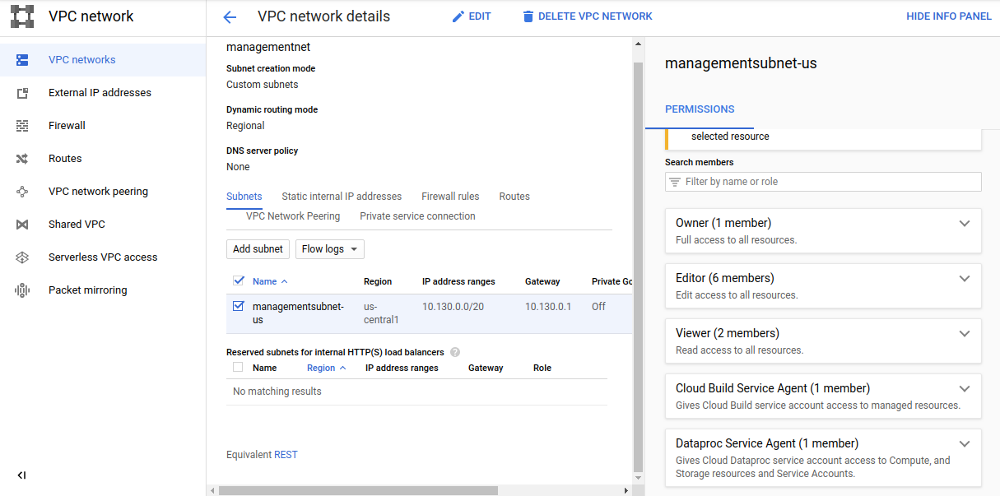
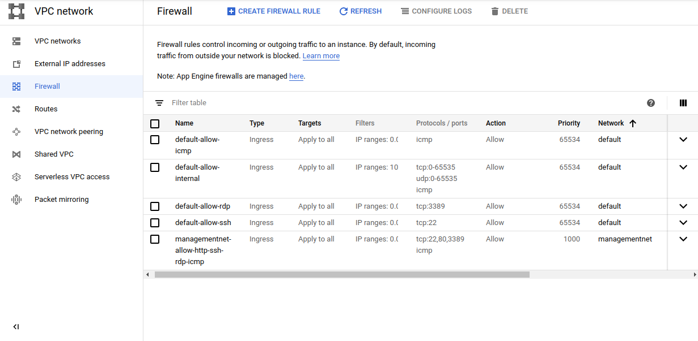
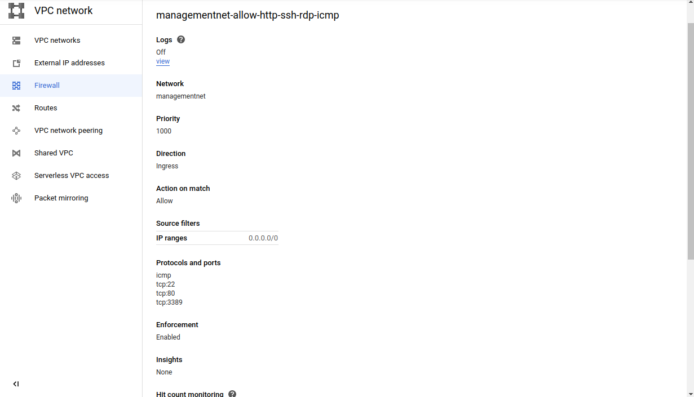
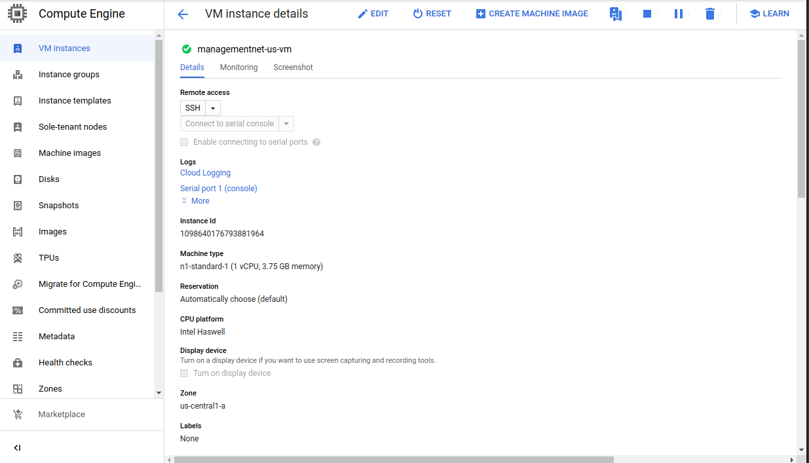
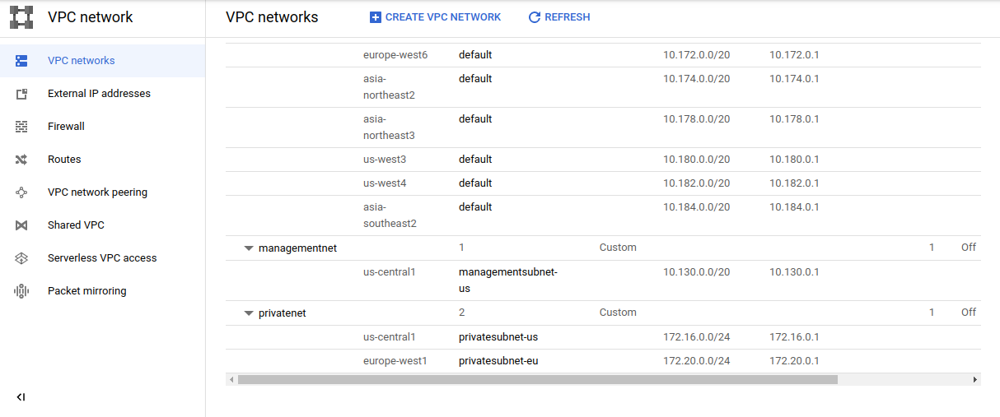
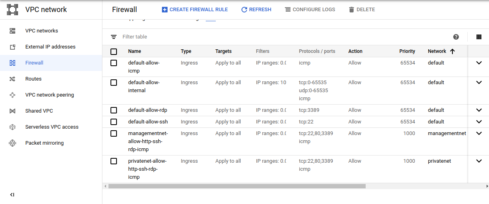
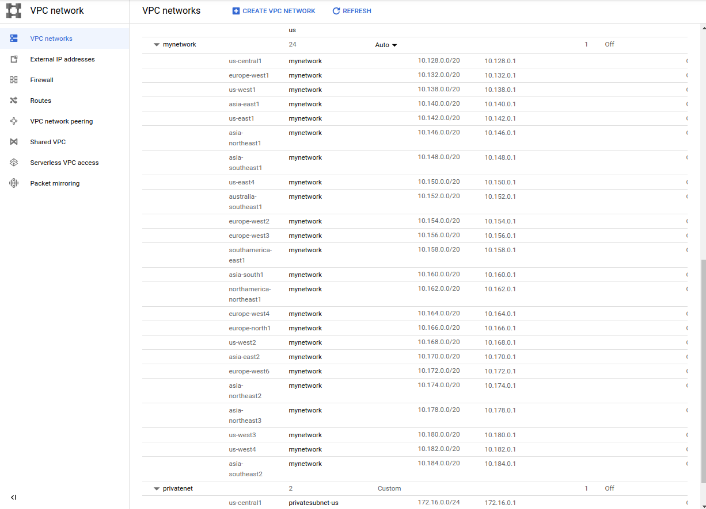
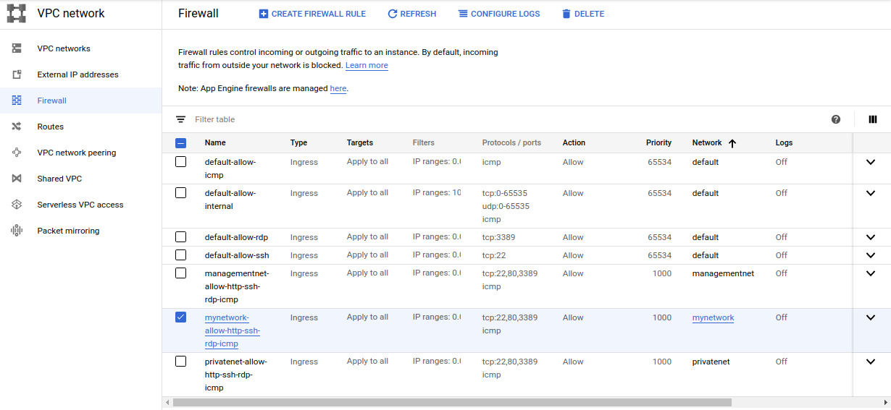
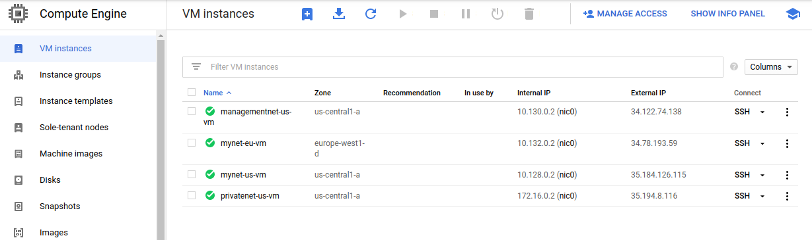
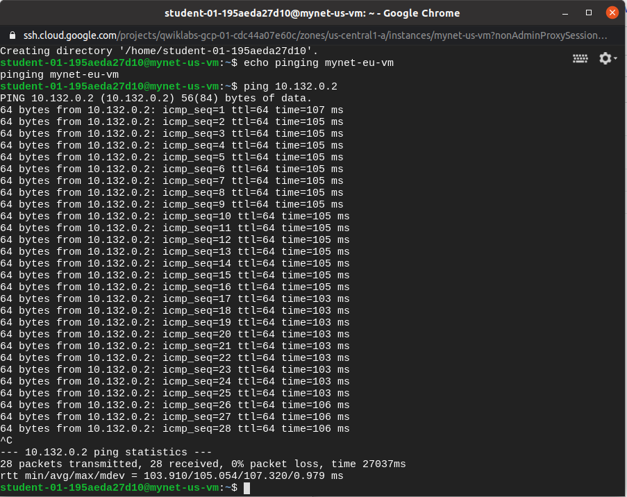

# Automating the Deployment of Networks Using Terraform

Lab Exercise

## Task 1. Set up Terraform and Cloud Shell

### [Install Terraform](https://learn.hashicorp.com/tutorials/terraform/install-cli#:~:text=To%20install%20Terraform%2C%20find%20the,and%20Terraform%20will%20still%20function.)

```
$ terraform --version
Terraform v0.12.24
```

### Create a directory for Terraform configuration

```
$ mkdir tfnet
```

### Initialize Terraform

created `tfnet/provider.tf`

```
$ terraform init
Initializing the backend...
Initializing provider plugins...
- Checking for available provider plugins...
- Downloading plugin for provider "google" (hashicorp/google) 3.39.0...
The following providers do not have any version constraints in configuration,
so the latest version was installed.
To prevent automatic upgrades to new major versions that may contain breaking
changes, it is recommended to add version = "..." constraints to the
corresponding provider blocks in configuration, with the constraint strings
suggested below.
* provider.google: version = "~> 3.39"
```

## Task 2. Create managementnet and its resources

### add google compute network

created `tfnet/managementnet.tf`

with contents of 

```
# Create the managementnet network
resource [RESOURCE_TYPE] "managementnet" {
name = [RESOURCE_NAME]
#RESOURCE properties go here
}
```

where 

```
[RESOURCE_TYPE] : "google_compute_network"
[RESOURCE_NAME] : "managementnet"
```

should also set

```
auto_create_subnetworks = "false"
```

### add subnet to management

```
# Create managementsubnet-us subnetwork
resource "google_compute_subnetwork" "managementsubnet-us" {
name          = "managementsubnet-us"
region        = "us-central1"
network       = google_compute_network.managementnet.self_link
ip_cidr_range = "10.130.0.0/20"
}
```

### Add firewall rules

```
# Add a firewall rule to allow HTTP, SSH, and RDP traffic on managementnet
resource [RESOURCE_TYPE] "managementnet-allow-http-ssh-rdp-icmp" {
name = [RESOURCE_NAME]
#RESOURCE properties go here
}
```

where

```
[RESOURCE_TYPE] : "google_compute_firewall"
[RESOURCE_NAME] : "managementnet-allow-http-ssh-rdp-icmp"
```

also set

```
network = google_compute_network.managementnet.self_link
```

add protocols

```
allow {
    protocol = "tcp"
    ports    = ["22", "80", "3389"]
    }
allow {
    protocol = "icmp"
    }
```

### Configure the VM instance

create `tfnet/instance/main.tf`

```
resource [RESOURCE_TYPE] "vm_instance" {
  name = [RESOURCE_NAME]
  #RESOURCE properties go here
}
```

where

```
[RESOURCE_TYPE] : "google_compute_instance"
[RESOURCE_NAME] : "${var.instance_name}"
```

also add zone and machine config

```
  zone         = "${var.instance_zone}"
  machine_type = "${var.instance_type}"
```

and boot disk property

```
  boot_disk {
    initialize_params {
      image = "debian-cloud/debian-9"
      }
  }
```

add network interface

```
  network_interface {
    subnetwork = "${var.instance_subnetwork}"
    access_config {
      # Allocate a one-to-one NAT IP to the instance
    }
  }
```

add vm instance to management.tf

```
# Add the managementnet-us-vm instance
module "managementnet-us-vm" {
  source           = "./instance"
  instance_name    = "managementnet-us-vm"
  instance_zone    = "us-central1-a"
  instance_subnetwork = google_compute_subnetwork.managementsubnet-us.self_link
}
```


## Create managementnet and its resources

Useful read  [Terraform Module registry](https://registry.terraform.io/browse?provider=google&verified=true).

Rewrite the Terraform configurations files to a canonical format

```
$ terraform fmt
managementnet.tf
```


Init terraform

```
$ terraform init
Initializing modules...
- managementnet-us-vm in instance
Initializing the backend...
Initializing provider plugins...
The following providers do not have any version constraints in configuration,
so the latest version was installed.
To prevent automatic upgrades to new major versions that may contain breaking
changes, it is recommended to add version = "..." constraints to the
corresponding provider blocks in configuration, with the constraint strings
suggested below.
* provider.google: version = "~> 3.39"
Terraform has been successfully initialized!

You may now begin working with Terraform. Try running "terraform plan" to see
any changes that are required for your infrastructure. All Terraform commands
should now work.

If you ever set or change modules or backend configuration for Terraform,
rerun this command to reinitialize your working directory. If you forget, other
commands will detect it and remind you to do so if necessary.
```

create execution plan

```
$ terraform plan
Refreshing Terraform state in-memory prior to plan...
The refreshed state will be used to calculate this plan, but will not be
persisted to local or remote state storage.
------------------------------------------------------------------------
An execution plan has been generated and is shown below.
Resource actions are indicated with the following symbols:
  + create
Terraform will perform the following actions:
  # google_compute_firewall.managementnet-allow-http-ssh-rdp-icmp will be created
  + resource "google_compute_firewall" "managementnet-allow-http-ssh-rdp-icmp" {
      + creation_timestamp = (known after apply)
      + destination_ranges = (known after apply)
      + direction          = (known after apply)
      + enable_logging     = (known after apply)
      + id                 = (known after apply)
      + name               = "managementnet-allow-http-ssh-rdp-icmp"
      + network            = (known after apply)
      + priority           = 1000
      + project            = (known after apply)
      + self_link          = (known after apply)
      + source_ranges      = (known after apply)
      + allow {
          + ports    = [
              + "22",
              + "80",
              + "3389",
            ]
          + protocol = "tcp"
        }
      + allow {
          + ports    = []
          + protocol = "icmp"
        }
    }
    
# google_compute_network.managementnet will be created
  + resource "google_compute_network" "managementnet" {
      + auto_create_subnetworks         = false
      + delete_default_routes_on_create = false
      + gateway_ipv4                    = (known after apply)
      + id                              = (known after apply)
      + ipv4_range                      = (known after apply)
      + name                            = "managementnet"
      + project                         = (known after apply)
      + routing_mode                    = (known after apply)
      + self_link                       = (known after apply)
    }
  # google_compute_subnetwork.managementsubnet-us will be created
  + resource "google_compute_subnetwork" "managementsubnet-us" {
      + creation_timestamp = (known after apply)
      + enable_flow_logs   = (known after apply)
      + fingerprint        = (known after apply)
      + gateway_address    = (known after apply)
      + id                 = (known after apply)
      + ip_cidr_range      = "10.130.0.0/20"
      + name               = "managementsubnet-us"
      + network            = (known after apply)
      + project            = (known after apply)
      + region             = "us-central1"
      + secondary_ip_range = (known after apply)
      + self_link          = (known after apply)
    }
# module.managementnet-us-vm.google_compute_instance.vm_instance will be created
  + resource "google_compute_instance" "vm_instance" {
      + can_ip_forward       = false
      + cpu_platform         = (known after apply)
      + current_status       = (known after apply)
      + deletion_protection  = false
      + guest_accelerator    = (known after apply)
      + id                   = (known after apply)
      + instance_id          = (known after apply)
      + label_fingerprint    = (known after apply)
      + machine_type         = "n1-standard-1"
      + metadata_fingerprint = (known after apply)
      + min_cpu_platform     = (known after apply)
      + name                 = "managementnet-us-vm"
      + project              = (known after apply)
      + self_link            = (known after apply)
      + tags_fingerprint     = (known after apply)
      + zone                 = "us-central1-a"
      + boot_disk {
          + auto_delete                = true
          + device_name                = (known after apply)
          + disk_encryption_key_sha256 = (known after apply)
          + kms_key_self_link          = (known after apply)
          + mode                       = "READ_WRITE"
          + source                     = (known after apply)
          + initialize_params {
              + image  = "debian-cloud/debian-9"
              + labels = (known after apply)
              + size   = (known after apply)
              + type   = (known after apply)
            }
        }
      + network_interface {
          + name               = (known after apply)
          + network            = (known after apply)
          + network_ip         = (known after apply)
          + subnetwork         = (known after apply)
          + subnetwork_project = (known after apply)
          + access_config {
              + nat_ip       = (known after apply)
              + network_tier = (known after apply)
            }
        }
      + scheduling {
          + automatic_restart   = (known after apply)
          + on_host_maintenance = (known after apply)
          + preemptible         = (known after apply)
          + node_affinities {
              + key      = (known after apply)
              + operator = (known after apply)
              + values   = (known after apply)
            }
        }
    }
Plan: 4 to add, 0 to change, 0 to destroy.
Warning: Interpolation-only expressions are deprecated
  on instance/main.tf line 9, in resource "google_compute_instance" "vm_instance":
   9:   name         = "${var.instance_name}"
Terraform 0.11 and earlier required all non-constant expressions to be
provided via interpolation syntax, but this pattern is now deprecated. To
silence this warning, remove the "${ sequence from the start and the }"
sequence from the end of this expression, leaving just the inner expression.
Template interpolation syntax is still used to construct strings from
expressions when the template includes multiple interpolation sequences or a
mixture of literal strings and interpolations. This deprecation applies only
to templates that consist entirely of a single interpolation sequence.
(and 3 more similar warnings elsewhere)
------------------------------------------------------------------------
Note: You didn't specify an "-out" parameter to save this plan, so Terraform
can't guarantee that exactly these actions will be performed if
"terraform apply" is subsequently run.

```

Terraform determined that the following 4 resources need to be added:

| Name                                  | Description                                    |
| :------------------------------------ | :--------------------------------------------- |
| managementnet                         | VPC network                                    |
| managementsubnet-us                   | Subnet of managementnet in us-central1         |
| managementnet_allow_http_ssh_rdp_icmp | Firewall rule to allow HTTP, SSH, RDP and ICMP |
| managementnet-us-vm                   | VM instance in us-central1-a                   |

### terraform apply

```
$ terraform apply
...

Plan: 4 to add, 0 to change, 0 to destroy.


Warning: Interpolation-only expressions are deprecated

  on instance/main.tf line 9, in resource "google_compute_instance" "vm_instance":
   9:   name         = "${var.instance_name}"

Terraform 0.11 and earlier required all non-constant expressions to be
provided via interpolation syntax, but this pattern is now deprecated. To
silence this warning, remove the "${ sequence from the start and the }"
sequence from the end of this expression, leaving just the inner expression.

Template interpolation syntax is still used to construct strings from
expressions when the template includes multiple interpolation sequences or a
mixture of literal strings and interpolations. This deprecation applies only
to templates that consist entirely of a single interpolation sequence.

(and 3 more similar warnings elsewhere)

Do you want to perform these actions?
  Terraform will perform the actions described above.
  Only 'yes' will be accepted to approve.

```


### confirm terraform apply

```
Enter a value:
$  yes
google_compute_network.managementnet: Creating...
google_compute_network.managementnet: Still creating... [10s elapsed]
google_compute_network.managementnet: Creation complete after 14s [id=projects/qwiklabs-gcp-01-cdc44a07e60c/global/networks/managementnet]
google_compute_firewall.managementnet-allow-http-ssh-rdp-icmp: Creating...
google_compute_subnetwork.managementsubnet-us: Creating...
google_compute_firewall.managementnet-allow-http-ssh-rdp-icmp: Still creating... [10s elapsed]
google_compute_subnetwork.managementsubnet-us: Still creating... [10s elapsed]
google_compute_firewall.managementnet-allow-http-ssh-rdp-icmp: Creation complete after 11s [id=projects/qwiklabs-gcp-01-cdc44a07e60c/global/firewalls/managementnet-allow-http-ssh-rdp-icmp]
google_compute_subnetwork.managementsubnet-us: Still creating... [20s elapsed]
google_compute_subnetwork.managementsubnet-us: Creation complete after 23s [id=projects/qwiklabs-gcp-01-cdc44a07e60c/regions/us-central1/subnetworks/managementsubnet-us]
module.managementnet-us-vm.google_compute_instance.vm_instance: Creating...
module.managementnet-us-vm.google_compute_instance.vm_instance: Still creating... [10s elapsed]
module.managementnet-us-vm.google_compute_instance.vm_instance: Creation complete after 14s [id=projects/qwiklabs-gcp-01-cdc44a07e60c/zones/us-central1-a/instances/managementnet-us-vm]

Apply complete! Resources: 4 added, 0 changed, 0 destroyed.
```

### Verify managementnet and its resources

created VPC networks




firewall rules





Created VM Instance



## Task 3. Create privatenet and its resources

create `privatenet.tf`

```
# Create privatenet network
resource "google_compute_network" "privatenet" {
name                    = "privatenet"
auto_create_subnetworks = false
}
```

Add the `privatesubnet-us subnet` resource to privatenet.tf

```
# Create privatesubnet-us subnetwork
resource "google_compute_subnetwork" "privatesubnet-us" {
name          = "privatesubnet-us"
region        = "us-central1"
network       = google_compute_network.privatenet.self_link
ip_cidr_range = "172.16.0.0/24"
}
```

Add the `privatesubnet-eu subnet` resource to privatenet.tf

```
# Create privatesubnet-eu subnetwork
resource "google_compute_subnetwork" "privatesubnet-eu" {
name          = "privatesubnet-eu"
region        = "europe-west1"
network       = google_compute_network.privatenet.self_link
ip_cidr_range = "172.20.0.0/24"
}
```

add firewall rule

```
# Create a firewall rule to allow HTTP, SSH, RDP and ICMP traffic on privatenet
resource "google_compute_firewall" "privatenet-allow-http-ssh-rdp-icmp" {
name    = "privatenet-allow-http-ssh-rdp-icmp"
network = google_compute_network.privatenet.self_link
allow {
    protocol = "tcp"
    ports    = ["22", "80", "3389"]
    }
allow {
    protocol = "icmp"
    }
}
```

Add VM Instance

```
# Add the privatenet-us-vm instance
module "privatenet-us-vm" {
  source           = "./instance"
  instance_name    = "privatenet-us-vm"
  instance_zone    = "us-central1-a"
  instance_subnetwork = google_compute_subnetwork.privatesubnet-us.self_link
}
```

### terraform apply

```
$ terraform fmt
privatenet.tf
```

```
$ terraform init
Initializing modules...
- privatenet-us-vm in instance

Initializing the backend...

Initializing provider plugins...

The following providers do not have any version constraints in configuration,
so the latest version was installed.

To prevent automatic upgrades to new major versions that may contain breaking
changes, it is recommended to add version = "..." constraints to the
corresponding provider blocks in configuration, with the constraint strings
suggested below.

* provider.google: version = "~> 3.39"

Terraform has been successfully initialized!

You may now begin working with Terraform. Try running "terraform plan" to see
any changes that are required for your infrastructure. All Terraform commands
should now work.

If you ever set or change modules or backend configuration for Terraform,
rerun this command to reinitialize your working directory. If you forget, other
commands will detect it and remind you to do so if necessary.
```

plan

```
$ terraform plan
efreshing Terraform state in-memory prior to plan...
The refreshed state will be used to calculate this plan, but will not be
persisted to local or remote state storage.

google_compute_network.managementnet: Refreshing state... [id=projects/qwiklabs-gcp-01-cdc44a07e60c/global/networks/managementnet]
google_compute_subnetwork.managementsubnet-us: Refreshing state... [id=projects/qwiklabs-gcp-01-cdc44a07e60c/regions/us-central1/subnetworks/managementsubnet-us]
google_compute_firewall.managementnet-allow-http-ssh-rdp-icmp: Refreshing state... [id=projects/qwiklabs-gcp-01-cdc44a07e60c/global/firewalls/managementnet-allow-http-ssh-rdp-icmp]
module.managementnet-us-vm.google_compute_instance.vm_instance: Refreshing state... [id=projects/qwiklabs-gcp-01-cdc44a07e60c/zones/us-central1-a/instances/managementnet-us-vm]

------------------------------------------------------------------------

An execution plan has been generated and is shown below.
Resource actions are indicated with the following symbols:
  + create

Terraform will perform the following actions:

  # google_compute_firewall.privatenet-allow-http-ssh-rdp-icmp will be created
  + resource "google_compute_firewall" "privatenet-allow-http-ssh-rdp-icmp" {
      + creation_timestamp = (known after apply)
      + destination_ranges = (known after apply)
      + direction          = (known after apply)
      + enable_logging     = (known after apply)
      + id                 = (known after apply)
      + name               = "privatenet-allow-http-ssh-rdp-icmp"
      + network            = (known after apply)
      + priority           = 1000
      + project            = (known after apply)
      + self_link          = (known after apply)
      + source_ranges      = (known after apply)

      + allow {
          + ports    = [
              + "22",
              + "80",
              + "3389",
            ]
          + protocol = "tcp"
        }
      + allow {
          + ports    = []
          + protocol = "icmp"
        }
    }
   # google_compute_network.privatenet will be created
  + resource "google_compute_network" "privatenet" {
      + auto_create_subnetworks         = false
      + delete_default_routes_on_create = false
      + gateway_ipv4                    = (known after apply)
      + id                              = (known after apply)
      + ipv4_range                      = (known after apply)
      + name                            = "privatenet"
      + project                         = (known after apply)
      + routing_mode                    = (known after apply)
      + self_link                       = (known after apply)
    }

  # google_compute_subnetwork.privatesubnet-eu will be created
  + resource "google_compute_subnetwork" "privatesubnet-eu" {
      + creation_timestamp = (known after apply)
      + enable_flow_logs   = (known after apply)
      + fingerprint        = (known after apply)
      + gateway_address    = (known after apply)
      + id                 = (known after apply)
      + ip_cidr_range      = "172.20.0.0/24"
      + name               = "privatesubnet-eu"
      + network            = (known after apply)
      + project            = (known after apply)
      + region             = "europe-west1"
      + secondary_ip_range = (known after apply)
      + self_link          = (known after apply)
    }

  # google_compute_subnetwork.privatesubnet-us will be created
  + resource "google_compute_subnetwork" "privatesubnet-us" {
      + creation_timestamp = (known after apply)
      + enable_flow_logs   = (known after apply)
      + fingerprint        = (known after apply)
      + gateway_address    = (known after apply)
      + id                 = (known after apply)
      + ip_cidr_range      = "172.16.0.0/24"
      + name               = "privatesubnet-us"
      + network            = (known after apply)
      + project            = (known after apply)
      + region             = "us-central1"
      + secondary_ip_range = (known after apply)
      + self_link          = (known after apply)
    }
   # module.privatenet-us-vm.google_compute_instance.vm_instance will be created
  + resource "google_compute_instance" "vm_instance" {
      + can_ip_forward       = false
      + cpu_platform         = (known after apply)
      + current_status       = (known after apply)
      + deletion_protection  = false
      + guest_accelerator    = (known after apply)
      + id                   = (known after apply)
      + instance_id          = (known after apply)
      + label_fingerprint    = (known after apply)
      + machine_type         = "n1-standard-1"
      + metadata_fingerprint = (known after apply)
      + min_cpu_platform     = (known after apply)
      + name                 = "privatenet-us-vm"
      + project              = (known after apply)
      + self_link            = (known after apply)
      + tags_fingerprint     = (known after apply)
      + zone                 = "us-central1-a"

      + boot_disk {
          + auto_delete                = true
          + device_name                = (known after apply)
          + disk_encryption_key_sha256 = (known after apply)
          + kms_key_self_link          = (known after apply)
          + mode                       = "READ_WRITE"
          + source                     = (known after apply)

          + initialize_params {
              + image  = "debian-cloud/debian-9"
              + labels = (known after apply)
              + size   = (known after apply)
              + type   = (known after apply)
            }
        }

      + network_interface {
          + name               = (known after apply)
          + network            = (known after apply)
          + network_ip         = (known after apply)
          + subnetwork         = (known after apply)
          + subnetwork_project = (known after apply)

          + access_config {
              + nat_ip       = (known after apply)
              + network_tier = (known after apply)
            }
        }
 
      + scheduling {
          + automatic_restart   = (known after apply)
          + on_host_maintenance = (known after apply)
          + preemptible         = (known after apply)

          + node_affinities {
              + key      = (known after apply)
              + operator = (known after apply)
              + values   = (known after apply)
            }
        }
    }

Plan: 5 to add, 0 to change, 0 to destroy.

Warning: Interpolation-only expressions are deprecated

  on instance/main.tf line 9, in resource "google_compute_instance" "vm_instance":
   9:   name         = "${var.instance_name}"

Terraform 0.11 and earlier required all non-constant expressions to be
provided via interpolation syntax, but this pattern is now deprecated. To
silence this warning, remove the "${ sequence from the start and the }"
sequence from the end of this expression, leaving just the inner expression.

Template interpolation syntax is still used to construct strings from
expressions when the template includes multiple interpolation sequences or a
mixture of literal strings and interpolations. This deprecation applies only
to templates that consist entirely of a single interpolation sequence.

(and 7 more similar warnings elsewhere)


------------------------------------------------------------------------

Note: You didn't specify an "-out" parameter to save this plan, so Terraform
can't guarantee that exactly these actions will be performed if
"terraform apply" is subsequently run.       
```

note

```
Plan: 5 to add, 0 to change, 0 to destroy.
```

Terraform determined that the following 5 resources need to be added:

| Name                               | Description                                    |
| :--------------------------------- | :--------------------------------------------- |
| privatenet                         | VPC network                                    |
| privatesubnet-us                   | Subnet of privatenet in us-central1            |
| privatesubnet-eu                   | Subnet of privatenet in europe-west1           |
| privatenet-allow-http-ssh-rdp-icmp | Firewall rule to allow HTTP, SSH, RDP and ICMP |
| privatenet-us-vm                   | VM instance in us-central1-a                   |

```
$ terraform apply
google_compute_network.managementnet: Refreshing state... [id=projects/qwiklabs-gcp-01-cdc44a07e60c/global/networks/managementnet]
google_compute_firewall.managementnet-allow-http-ssh-rdp-icmp: Refreshing state... [id=projects/qwiklabs-gcp-01-cdc44a07e60c/global/firewalls/managementnet-allow-http-ssh-rdp-icmp]
google_compute_subnetwork.managementsubnet-us: Refreshing state... [id=projects/qwiklabs-gcp-01-cdc44a07e60c/regions/us-central1/subnetworks/managementsubnet-us]
module.managementnet-us-vm.google_compute_instance.vm_instance: Refreshing state... [id=projects/qwiklabs-gcp-01-cdc44a07e60c/zones/us-central1-a/instances/managementnet-us-vm]
...

Plan: 5 to add, 0 to change, 0 to destroy.


Warning: Interpolation-only expressions are deprecated

  on instance/main.tf line 9, in resource "google_compute_instance" "vm_instance":
   9:   name         = "${var.instance_name}"

Terraform 0.11 and earlier required all non-constant expressions to be
provided via interpolation syntax, but this pattern is now deprecated. To
silence this warning, remove the "${ sequence from the start and the }"
sequence from the end of this expression, leaving just the inner expression.

Template interpolation syntax is still used to construct strings from
expressions when the template includes multiple interpolation sequences or a
mixture of literal strings and interpolations. This deprecation applies only
to templates that consist entirely of a single interpolation sequence.

(and 7 more similar warnings elsewhere)

Do you want to perform these actions?
  Terraform will perform the actions described above.
  Only 'yes' will be accepted to approve.
```

### confirm terraform apply

```
Enter a value:
$ yes

google_compute_network.privatenet: Creating...
google_compute_network.privatenet: Still creating... [10s elapsed]
google_compute_network.privatenet: Creation complete after 11s [id=projects/qwiklabs-gcp-01-cdc44a07e60c/global/networks/privatenet]
google_compute_subnetwork.privatesubnet-eu: Creating...
google_compute_firewall.privatenet-allow-http-ssh-rdp-icmp: Creating...
google_compute_subnetwork.privatesubnet-us: Creating...
google_compute_subnetwork.privatesubnet-eu: Still creating... [10s elapsed]
google_compute_firewall.privatenet-allow-http-ssh-rdp-icmp: Still creating... [10s elapsed]
google_compute_subnetwork.privatesubnet-us: Still creating... [10s elapsed]
google_compute_firewall.privatenet-allow-http-ssh-rdp-icmp: Creation complete after 11s [id=projects/qwiklabs-gcp-01-cdc44a07e60c/global/firewalls/privatenet-allow-http-ssh-rdp-icmp]
google_compute_subnetwork.privatesubnet-eu: Creation complete after 11s [id=projects/qwiklabs-gcp-01-cdc44a07e60c/regions/europe-west1/subnetworks/privatesubnet-eu]
google_compute_subnetwork.privatesubnet-us: Still creating... [20s elapsed]
google_compute_subnetwork.privatesubnet-us: Creation complete after 22s [id=projects/qwiklabs-gcp-01-cdc44a07e60c/regions/us-central1/subnetworks/privatesubnet-us]
module.privatenet-us-vm.google_compute_instance.vm_instance: Creating...
module.privatenet-us-vm.google_compute_instance.vm_instance: Still creating... [10s elapsed]
module.privatenet-us-vm.google_compute_instance.vm_instance: Creation complete after 13s [id=projects/qwiklabs-gcp-01-cdc44a07e60c/zones/us-central1-a/instances/privatenet-us-vm]

Apply complete! Resources: 5 added, 0 changed, 0 destroyed.
```

### Verify privatenet and its resources






#### Test connectivity to privatenet-us-vm's internal IP address

it should not work because they are on separate VPC networks. 

```
$ ping 172.16.0.2
PING 172.16.0.2 (172.16.0.2) 56(84) bytes of data.
```

## Task 4. Create mynetwork and its resources

### create terraform config

Create the auto-mode network mynetwork along with its firewall rule and two VM instances (mynet_us_vm and mynet_eu_vm).

create file `tfnet/mynetwork.tf`

```
# Create the mynetwork network
resource "google_compute_network" "mynetwork" {
name                    = "mynetwork"
#RESOURCE properties go here
}
```

add config

```
auto_create_subnetworks = "true"
```

add firewall

```
# Create a firewall rule to allow HTTP, SSH, RDP and ICMP traffic on mynetwork
resource "google_compute_firewall" "mynetwork_allow_http_ssh_rdp_icmp" {
name    = "mynetwork-allow-http-ssh-rdp-icmp"
network = google_compute_network.mynetwork.self_link
allow {
    protocol = "tcp"
    ports    = ["22", "80", "3389"]
    }
allow {
    protocol = "icmp"
    }
}
```

add vm instance

```
# Create the mynet-us-vm instance
module "mynet-us-vm" {
  source           = "./instance"
  instance_name    = "mynet-us-vm"
  instance_zone    = "us-central1-a"
  instance_subnetwork = google_compute_network.mynetwork.self_link
}

# Create the mynet-eu-vm" instance
module "mynet-eu-vm" {
  source           = "./instance"
  instance_name    = "mynet-eu-vm"
  instance_zone    = "europe-west1-d"
  instance_subnetwork = google_compute_network.mynetwork.self_link
}
```

### staging and apply terraform

Rewrite the Terraform configurations files to a canonical format and style

```
$ terraform fmt
mynetwork.tf
```

init

```
$ terraform init
Initializing modules...
- mynet-eu-vm in instance
- mynet-us-vm in instance

Initializing the backend...

Initializing provider plugins...

The following providers do not have any version constraints in configuration,
so the latest version was installed.

To prevent automatic upgrades to new major versions that may contain breaking
changes, it is recommended to add version = "..." constraints to the
corresponding provider blocks in configuration, with the constraint strings
suggested below.

* provider.google: version = "~> 3.39"

Terraform has been successfully initialized!

You may now begin working with Terraform. Try running "terraform plan" to see
any changes that are required for your infrastructure. All Terraform commands
should now work.

If you ever set or change modules or backend configuration for Terraform,
rerun this command to reinitialize your working directory. If you forget, other
commands will detect it and remind you to do so if necessary.
```

plan

```
$ terraform plan
Refreshing Terraform state in-memory prior to plan...
The refreshed state will be used to calculate this plan, but will not be
persisted to local or remote state storage.

google_compute_network.privatenet: Refreshing state... [id=projects/qwiklabs-gcp-01-cdc44a07e60c/global/networks/privatenet]
google_compute_network.managementnet: Refreshing state... [id=projects/qwiklabs-gcp-01-cdc44a07e60c/global/networks/managementnet]
google_compute_subnetwork.managementsubnet-us: Refreshing state... [id=projects/qwiklabs-gcp-01-cdc44a07e60c/regions/us-central1/subnetworks/managementsubnet-us]
google_compute_firewall.managementnet-allow-http-ssh-rdp-icmp: Refreshing state... [id=projects/qwiklabs-gcp-01-cdc44a07e60c/global/firewalls/managementnet-allow-http-ssh-rdp-icmp]
google_compute_subnetwork.privatesubnet-eu: Refreshing state... [id=projects/qwiklabs-gcp-01-cdc44a07e60c/regions/europe-west1/subnetworks/privatesubnet-eu]
google_compute_subnetwork.privatesubnet-us: Refreshing state... [id=projects/qwiklabs-gcp-01-cdc44a07e60c/regions/us-central1/subnetworks/privatesubnet-us]
google_compute_firewall.privatenet-allow-http-ssh-rdp-icmp: Refreshing state... [id=projects/qwiklabs-gcp-01-cdc44a07e60c/global/firewalls/privatenet-allow-http-ssh-rdp-icmp]
module.managementnet-us-vm.google_compute_instance.vm_instance: Refreshing state... [id=projects/qwiklabs-gcp-01-cdc44a07e60c/zones/us-central1-a/instances/managementnet-us-vm]
module.privatenet-us-vm.google_compute_instance.vm_instance: Refreshing state... [id=projects/qwiklabs-gcp-01-cdc44a07e60c/zones/us-central1-a/instances/privatenet-us-vm]

------------------------------------------------------------------------

An execution plan has been generated and is shown below.
Resource actions are indicated with the following symbols:
  + create

Terraform will perform the following actions:

  # google_compute_firewall.mynetwork_allow_http_ssh_rdp_icmp will be created
  + resource "google_compute_firewall" "mynetwork_allow_http_ssh_rdp_icmp" {
      + creation_timestamp = (known after apply)
      + destination_ranges = (known after apply)
      + direction          = (known after apply)
      + enable_logging     = (known after apply)
      + id                 = (known after apply)
      + name               = "mynetwork-allow-http-ssh-rdp-icmp"
      + network            = (known after apply)
      + priority           = 1000
      + project            = (known after apply)
      + self_link          = (known after apply)
      + source_ranges      = (known after apply)

      + allow {
          + ports    = [
              + "22",
              + "80",
              + "3389",
            ]
          + protocol = "tcp"
        }
      + allow {
          + ports    = []
          + protocol = "icmp"
        }
    }

  # google_compute_network.mynetwork will be created
  + resource "google_compute_network" "mynetwork" {
      + auto_create_subnetworks         = true
      + delete_default_routes_on_create = false
      + gateway_ipv4                    = (known after apply)
      + id                              = (known after apply)
      + ipv4_range                      = (known after apply)
      + name                            = "mynetwork"
      + project                         = (known after apply)
      + routing_mode                    = (known after apply)
      + self_link                       = (known after apply)
    }
      + name                 = "mynet-eu-vm"
      + project              = (known after apply)
      + self_link            = (known after apply)
      + tags_fingerprint     = (known after apply)
      + zone                 = "europe-west1-d"

      + boot_disk {
          + auto_delete                = true
          + device_name                = (known after apply)
          + disk_encryption_key_sha256 = (known after apply)
          + kms_key_self_link          = (known after apply)
          + mode                       = "READ_WRITE"
          + source                     = (known after apply)

          + initialize_params {
              + image  = "debian-cloud/debian-9"
              + labels = (known after apply)
              + size   = (known after apply)
              + type   = (known after apply)
            }
        }

      + network_interface {
          + name               = (known after apply)
          + network            = (known after apply)
          + network_ip         = (known after apply)
          + subnetwork         = (known after apply)
          + subnetwork_project = (known after apply)

          + access_config {
              + nat_ip       = (known after apply)
              + network_tier = (known after apply)
            }
        }

      + scheduling {
          + automatic_restart   = (known after apply)
          + on_host_maintenance = (known after apply)
          + preemptible         = (known after apply)

          + node_affinities {
              + key      = (known after apply)
              + operator = (known after apply)
              + values   = (known after apply)
            }
        }
    }
  # module.mynet-us-vm.google_compute_instance.vm_instance will be created
  + resource "google_compute_instance" "vm_instance" {
      + can_ip_forward       = false
      + cpu_platform         = (known after apply)
      + current_status       = (known after apply)
      + deletion_protection  = false
      + guest_accelerator    = (known after apply)
      + id                   = (known after apply)
      + instance_id          = (known after apply)
      + label_fingerprint    = (known after apply)
      + machine_type         = "n1-standard-1"
      + metadata_fingerprint = (known after apply)
      + min_cpu_platform     = (known after apply)
      + name                 = "mynet-us-vm"
      + project              = (known after apply)
      + self_link            = (known after apply)
      + tags_fingerprint     = (known after apply)
      + zone                 = "us-central1-a"

      + boot_disk {
          + auto_delete                = true
          + device_name                = (known after apply)
          + disk_encryption_key_sha256 = (known after apply)
          + kms_key_self_link          = (known after apply)
          + mode                       = "READ_WRITE"
          + source                     = (known after apply)

          + initialize_params {
              + image  = "debian-cloud/debian-9"
              + labels = (known after apply)
              + size   = (known after apply)
              + type   = (known after apply)
            }
        }
      + network_interface {
          + name               = (known after apply)
          + network            = (known after apply)
          + network_ip         = (known after apply)
          + subnetwork         = (known after apply)
          + subnetwork_project = (known after apply)

          + access_config {
              + nat_ip       = (known after apply)
              + network_tier = (known after apply)
            }
        }

      + scheduling {
          + automatic_restart   = (known after apply)
          + on_host_maintenance = (known after apply)
          + preemptible         = (known after apply)

          + node_affinities {
              + key      = (known after apply)
              + operator = (known after apply)
              + values   = (known after apply)
            }
        }
    }
 
Plan: 4 to add, 0 to change, 0 to destroy.

Warning: Interpolation-only expressions are deprecated

  on instance/main.tf line 9, in resource "google_compute_instance" "vm_instance":
   9:   name         = "${var.instance_name}"

Terraform 0.11 and earlier required all non-constant expressions to be
provided via interpolation syntax, but this pattern is now deprecated. To
silence this warning, remove the "${ sequence from the start and the }"
sequence from the end of this expression, leaving just the inner expression.

Template interpolation syntax is still used to construct strings from
expressions when the template includes multiple interpolation sequences or a
mixture of literal strings and interpolations. This deprecation applies only
to templates that consist entirely of a single interpolation sequence.

(and 15 more similar warnings elsewhere)


------------------------------------------------------------------------

Note: You didn't specify an "-out" parameter to save this plan, so Terraform
can't guarantee that exactly these actions will be performed if
"terraform apply" is subsequently run.   
```

Terraform determined that the following 4 resources need to be added:

| Name                              | Description                                    |
| :-------------------------------- | :--------------------------------------------- |
| mynetwork                         | VPC network                                    |
| mynetwork-allow-http-ssh-rdp-icmp | Firewall rule to allow HTTP, SSH, RDP and ICMP |
| mynet-us-vm                       | VM instance in us-central1-a                   |
| mynet-eu-vm                       | VM instance in europe-west1-d                  |

### terraform apply

```
$ terraform apply
google_compute_network.privatenet: Refreshing state... [id=projects/qwiklabs-gcp-01-cdc44a07e60c/global/networks/privatenet]
google_compute_network.managementnet: Refreshing state... [id=projects/qwiklabs-gcp-01-cdc44a07e60c/global/networks/managementnet]
google_compute_subnetwork.managementsubnet-us: Refreshing state... [id=projects/qwiklabs-gcp-01-cdc44a07e60c/regions/us-central1/subnetworks/managementsubnet-us]
google_compute_subnetwork.privatesubnet-eu: Refreshing state... [id=projects/qwiklabs-gcp-01-cdc44a07e60c/regions/europe-west1/subnetworks/privatesubnet-eu]
google_compute_firewall.managementnet-allow-http-ssh-rdp-icmp: Refreshing state... [id=projects/qwiklabs-gcp-01-cdc44a07e60c/global/firewalls/managementnet-allow-http-ssh-rdp-icmp]
google_compute_subnetwork.privatesubnet-us: Refreshing state... [id=projects/qwiklabs-gcp-01-cdc44a07e60c/regions/us-central1/subnetworks/privatesubnet-us]
google_compute_firewall.privatenet-allow-http-ssh-rdp-icmp: Refreshing state... [id=projects/qwiklabs-gcp-01-cdc44a07e60c/global/firewalls/privatenet-allow-http-ssh-rdp-icmp]
module.privatenet-us-vm.google_compute_instance.vm_instance: Refreshing state... [id=projects/qwiklabs-gcp-01-cdc44a07e60c/zones/us-central1-a/instances/privatenet-us-vm]
module.managementnet-us-vm.google_compute_instance.vm_instance: Refreshing state... [id=projects/qwiklabs-gcp-01-cdc44a07e60c/zones/us-central1-a/instances/managementnet-us-vm]
...

Plan: 4 to add, 0 to change, 0 to destroy.


Warning: Interpolation-only expressions are deprecated

  on instance/main.tf line 9, in resource "google_compute_instance" "vm_instance":
   9:   name         = "${var.instance_name}"

Terraform 0.11 and earlier required all non-constant expressions to be
provided via interpolation syntax, but this pattern is now deprecated. To
silence this warning, remove the "${ sequence from the start and the }"
sequence from the end of this expression, leaving just the inner expression.

Template interpolation syntax is still used to construct strings from
expressions when the template includes multiple interpolation sequences or a
mixture of literal strings and interpolations. This deprecation applies only
to templates that consist entirely of a single interpolation sequence.

(and 15 more similar warnings elsewhere)

Do you want to perform these actions?
  Terraform will perform the actions described above.
  Only 'yes' will be accepted to approve.
```

confirm apply

```
  Enter a value:
$ yes


google_compute_network.mynetwork: Creating...
google_compute_network.mynetwork: Still creating... [10s elapsed]
google_compute_network.mynetwork: Still creating... [20s elapsed]
google_compute_network.mynetwork: Still creating... [30s elapsed]
google_compute_network.mynetwork: Still creating... [40s elapsed]
google_compute_network.mynetwork: Creation complete after 42s [id=projects/qwiklabs-gcp-01-cdc44a07e60c/global/networks/mynetwork]
google_compute_firewall.mynetwork_allow_http_ssh_rdp_icmp: Creating...
module.mynet-us-vm.google_compute_instance.vm_instance: Creating...
module.mynet-eu-vm.google_compute_instance.vm_instance: Creating...
google_compute_firewall.mynetwork_allow_http_ssh_rdp_icmp: Still creating... [10s elapsed]
module.mynet-us-vm.google_compute_instance.vm_instance: Still creating... [10s elapsed]
module.mynet-eu-vm.google_compute_instance.vm_instance: Still creating... [10s elapsed]
google_compute_firewall.mynetwork_allow_http_ssh_rdp_icmp: Creation complete after 11s [id=projects/qwiklabs-gcp-01-cdc44a07e60c/global/firewalls/mynetwork-allow-http-ssh-rdp-icmp]
module.mynet-us-vm.google_compute_instance.vm_instance: Creation complete after 12s [id=projects/qwiklabs-gcp-01-cdc44a07e60c/zones/us-central1-a/instances/mynet-us-vm]
module.mynet-eu-vm.google_compute_instance.vm_instance: Still creating... [20s elapsed]
module.mynet-eu-vm.google_compute_instance.vm_instance: Creation complete after 25s [id=projects/qwiklabs-gcp-01-cdc44a07e60c/zones/europe-west1-d/instances/mynet-eu-vm]

Apply complete! Resources: 4 added, 0 changed, 0 destroyed.
```

### Verify mynetwork and its resources







#### pinging mynet-eu-vm



this works because because both VM instances are on the same network, and ICMP traffic is allowed.